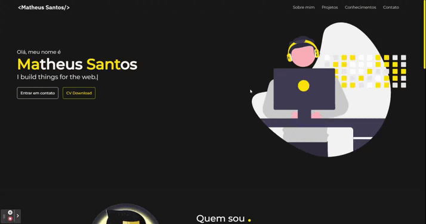

# Meu Portfólio

> Meu Portfólio onde faço uma breve apresentação sobre mim, meus conhecimentos e meus projetos.

Confira a aplicação: https://www.mtsantos.com.br

## :rocket: Tecnologias ##

No projeto foram utilizadas as seguintes tecnologias:

- [ReactJs](https://pt-br.reactjs.org)  
- [Styled Components](https://styled-components.com/)

## 🤝 Colaboradores

Agradecemos às seguintes pessoas que contribuíram para este projeto:

<table>
  <tr>
    <td align="center">
      <a href="#">
         
        
          <b>Matheus Santos</b>
        
      </a>
    </td>
  </tr>
</table>

## 📝 Licença

Este projeto está sob licença. Consulte o arquivo [LICENSE](LICENSE.md) para obter mais detalhes.

Made with ♥ by Matheus Santos 👋 Get in touch!

<a href="#top">Volte para o topo</a>
